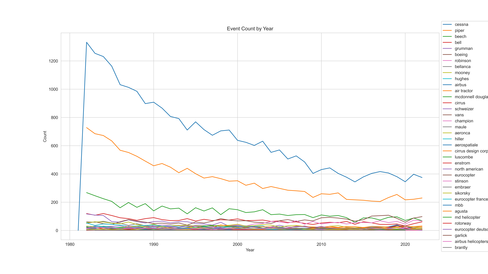
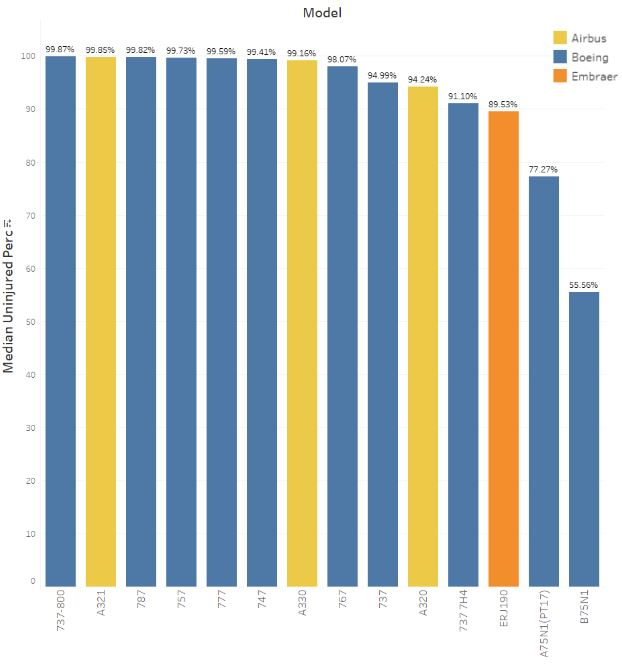
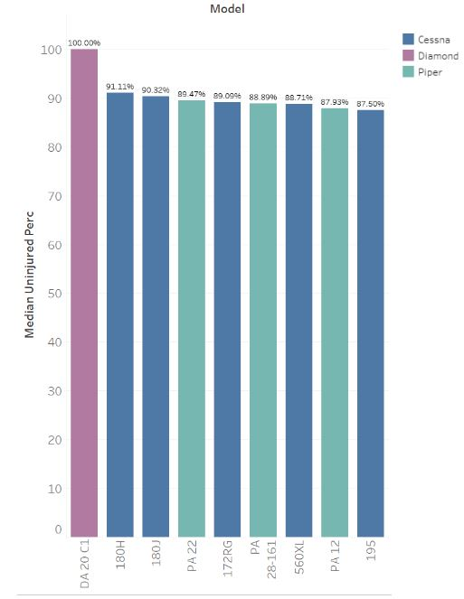

# README for Aviation Project

### Navigating our notebook
- project 1 analysis: main body of work for creating our graph/logic. All our calculations for our metric of success is done here
- project 1 analysis table: same as above but for table viewing
- project 1 clean df: where we cleaned our data frame
- project 1 mess: unstructured exploration of the data
- year graph notebook: where the yearly accident graph was created

## OVERVIEW:
- Researching crash data for selecting a plane for a new venture.

## BUSINESS UNDERSTANDING
- Stakeholders: business leadership for commercial airliners or sightseeing enterprises
- Key business questions: Determining which aircraft are the lowest risk for the company to start this new business endeavor.

## DATA UNDERSTANDING AND ANALYSIS
- Sources: [KAGGLE Aviation Accident Database](https://www.kaggle.com/datasets/khsamaha/aviation-accident-database-synopses)
- Description: Database of aviation accidents from 1962 - 2022 containing various information on each incident
- Visual:

## CONCLUSIONS
- Recommendations for commercial: Boeing 737-800, Airbus A321, Boeing 787
- Recommendations for sightseeing: Diamond DA 20 C1, Cessna 180H, Cessna 180J, and Piper PA 22

## INTERACTIVE DASHBOARD LINK
 [Commercial Dashboard](https://public.tableau.com/app/profile/samuel.song5286/viz/phase1_project_sheet_1/Sheet1?publish=yes)

 [Sightseeing Dashboard](https://public.tableau.com/app/profile/samuel.song5286/viz/phase1_project_sheet_2/Sheet2?publish=yes)

